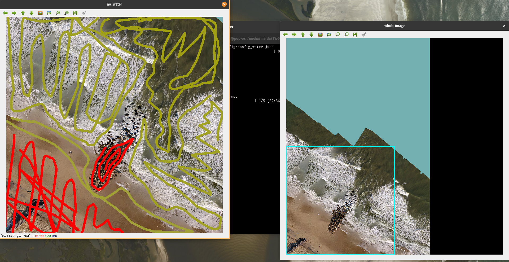
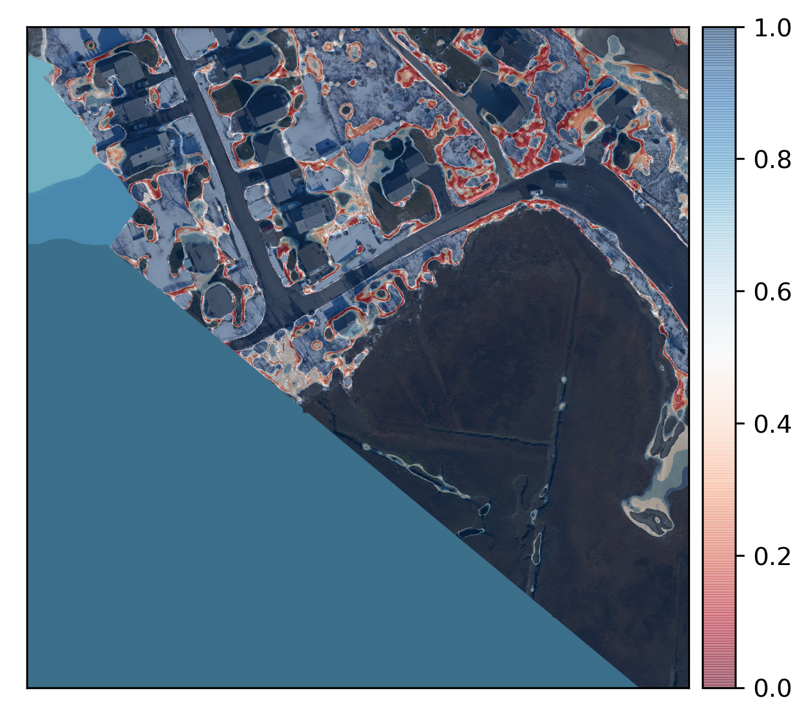

This goes through a full workflow from scratch on a particular set of images, starting with the config file, the doodling, optimizing, and finally merging

### The data and classes

We're going to use the Sandwich imagery we made in a blog post. Data come from Chris Sherwood, USGS Woods Hole. Put the images you want to label in one session inside the `data/images` folder.


We have 5 images, and will label each of these images twice (in two separate `doodler` sessions)

### `config` file creation

Our file looks like this

```
{
  "image_folder" : "data/images",
  "label_folder": "data/label_images",
  "max_x_steps": 2,
  "max_y_steps": 2,
  "ref_im_scale": 0.8,
  "lw": 25,
  "im_order": "RGB",
  "alpha": 0.5,
  "create_gtiff": "true",
  "apply_mask": "None",
  "medfilt": "false",
  "fact": 3,
  "classes": {
    "deep": "#2f36aa",
    "whitewater": "#E317CE",
    "shallow": "#b3946b",
    "no_water": "#e35259"
   }
}
```

The `image_folder` where the images are is `"data/images"` and the `label_folder` is `"data/label_images"`, where the results will be put. To control the size of the labelling window, `max_x_steps` and `max_y_steps` are both set to 2, so we'll label 4 windows.

We set `ref_im_scale` as 0.8 to control the window size (this value should work for many screen sizes), `lw` (pen line width) is 25. The image channel order, `im_order`, is `"RGB"` and the outplot plot transparency, or `alpha`, 0.5 (i.e. 50%). We specify `create_gtiff` as `"true"` to create a geoTIFF format label output, since our input files are also geoTIFFs.

`apply_mask` is `"None"` because we are not applying masks on the image prior to labelling (we do that later).
We specify `medfilt` as `"false"` to suppress median filtering (only use if you have high-frequency noise) and `fact` as 3, to subsample the image such that it is a third of the original size. It is subsequently scaled up after CRF inference.

You doodle the classes in the order that you specify them here. The 4 `classes` listed in this case study represent deep water (cannot see the underlying seabed), whitewater (aerated water from wave breaking), shallow (can see the seabed, including obviously wet terrain), and no water (dry terrain).

The colour codes associated with each class come from an online hex colour picker such as [here](https://htmlcolorcodes.com/).


### Doodling

We'll first classify for four classes related to water, as described above. Launch the program by calling the config file you created above:


---------------------------------------

Below are some examples of doodles. This hopefully gives you a sense of the level of doodling required.





When the last tile of the last image is annotated, the screen will look like this as it starts the inference process:


This is how the screen looks when it is finished - go check the results in `data/label_images` (if that is what you specified in the config file)


---------------------------------------

### Examining the results

Below is the transparent overlay printout from one of the images. The first image shows the transparent overlay label image (left) and doodles (right). Looks good.


---------------------------------------

This image is an estimate of the probability of the above label estimate. Probabilities are high everywhere except a couple of locations near the shoreline.


### Doodling on second set of classes

Next, we'll label the second set of classes. We deliberately do not specify a `do_mask` label, because I want to demonstrate how it's ok not to label parts of the scene (in the upcoming case, water) if you're merging those classes in later, which is what we will do.

This is the new config file, with new classes:

```
{
  "image_folder" : "data/images",
  "label_folder": "data/label_images",
  "max_x_steps": 4,
  "max_y_steps": 4,
  "ref_im_scale": 0.8,
  "lw": 10,
  "im_order": "RGB",
  "alpha": 0.5,
  "create_gtiff": "false",
  "medfilt": "false",
  "fact": 3,
  "classes": {
    "anthro": "#aa352f",
    "vegetation": "#2faa58",
    "mud": "#aa8b2f",
    "sand": "#a0aa2f",
    "submerged": "#84aa2f",
    "gravel": "#186074",
    "boulder": "#4f7373",
    "wrack_peat": "#aa2f9c",
    "snow_ice": "#aa2f69",
    "shell": "#84b1b4"
   }
}
```

Ok, let's go again - some select examples from the process:


---------------------------------------


---------------------------------------


### Examining the results, and merging

The label and probability images look reasonable



---------------------------------------

To merge the 10-class and 4-class label maps together, create a merge config file that lists all classes in the correct order.

Note this must be carried out on an image by image basis: note that we specify `name` to be `"2017-02-14_5cm_5000_0"`. The labels to merge are listed in the order of precedence, in case of overlapping labels.

The label is identified by the first class only, so we specify `to_merge` as `["deep","anthro"]`, then list the classes below in order.

It does not matter what you call the classes (we use `classesA` and `classesB`).

```
{
  "image_folder" : "data/images",
  "label_folder": "data/label_images",
  "im_order": "RGB",
  "alpha": 0.5,
  "create_gtiff": "true",
  "name": "2017-02-14_5cm_5000_0",

  "to_merge": ["deep","anthro"],

  "classesA": {
    "deep": "#2f36aa",
    "whitewater": "#E317CE",
    "shallow": "#b3946b",
    "no_water": "#e35259"
  },

  "classesB": {
    "anthro": "#aa352f",
    "vegetation": "#2faa58",
    "mud": "#aa8b2f",
    "sand": "#a0aa2f",
    "submerged_sediment": "#84aa2f",
    "gravel": "#186074",
    "boulder": "#4f7373",
    "wrack_peat": "#aa2f9c",
    "snow_ice": "#aa2f69",
    "shell": "#84b1b4"
   }
}
```

Run `merge.py`


Here is the final merged label image overlay:


---------------------------------------
