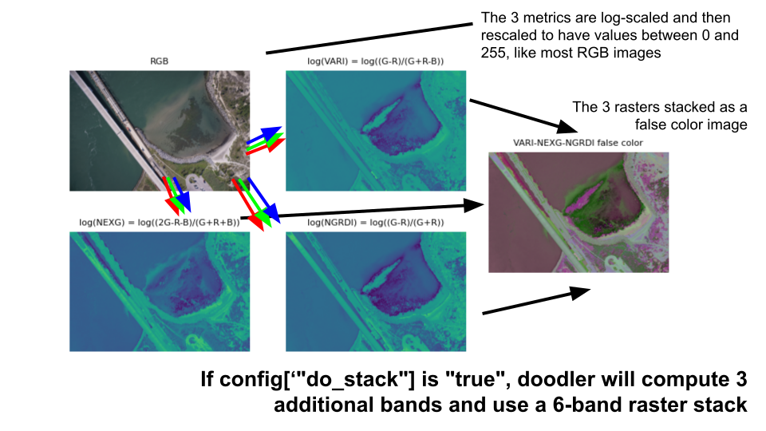
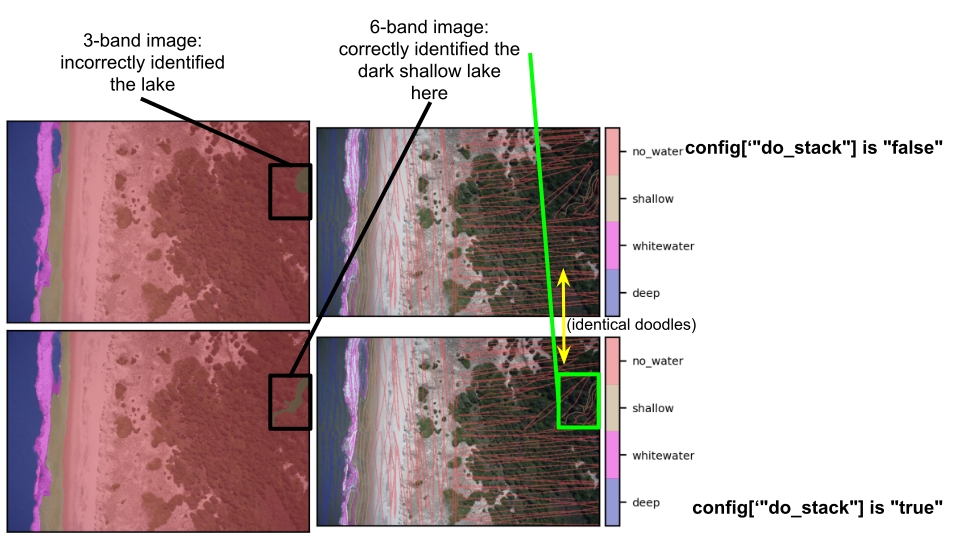
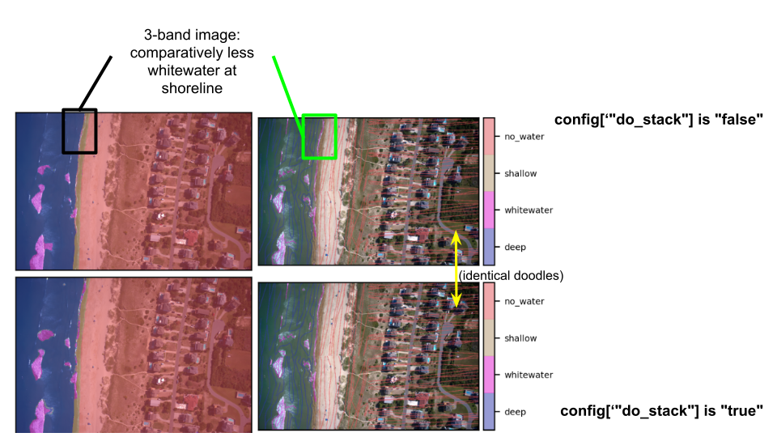
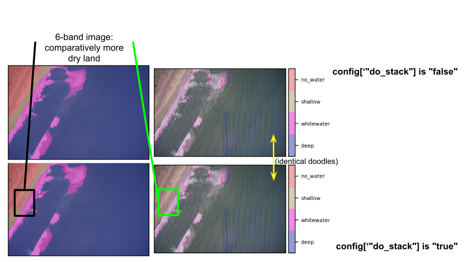

By default, the model will use the provided 3-band (RGB) image in combination with another 3-band raster, derived from the first, and uses both (i.e. a stacked 6-band raster) for inference. The second stack is comprised of 3 rasters and the model has more features per class to work with to make an inference.

There are usually advantages to this in terms of the final inference, so is currently set by default, but it does use more memory.

If, in the `config` file, you specify

`"do_stack": "false"`,

only the RGB input image will be used. Below is a visual guide to some example differences between 3- and 6-band raster stack inference

---------------------------------------

---------------------------------------

---------------------------------------

---------------------------------------

---------------------------------------

---------------------------------------
